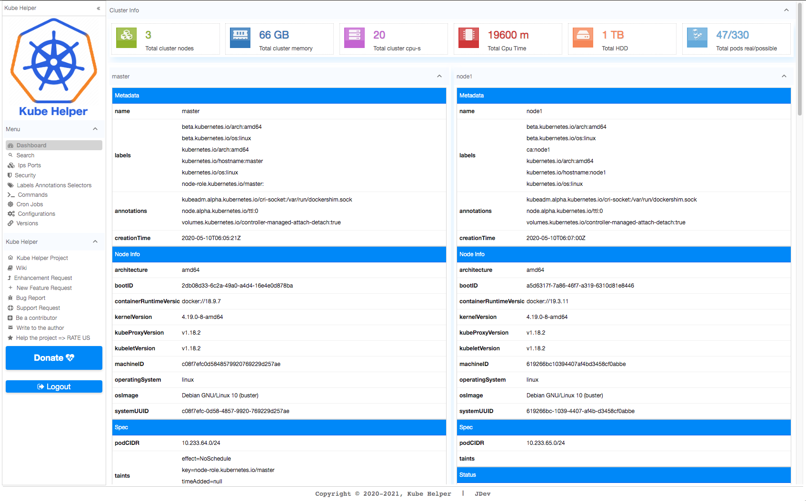

# [Kube Helper](https://github.com/KubeHelper/kubehelper)

<p align="center">
  
</p>
 
---       

##### KubeHelper - simplifies many daily Kubernetes cluster tasks through a graphical web interface. Search, analysis, run commands, cron jobs, reports, filters, git synchronization and many more.

[](https://github.com/KubeHelper/kubehelper/blob/main/LICENSE)


[](https://sonarcloud.io/dashboard?id=KubeHelper_kubehelper)
[](https://sonarcloud.io/dashboard?id=KubeHelper_kubehelper)
[](https://sonarcloud.io/dashboard?id=KubeHelper_kubehelper)
[](https://sonarcloud.io/dashboard?id=KubeHelper_kubehelper)


## Features

* [Dashboard - common cluster information.](https://github.com/KubeHelper/kubehelper/wiki/Home#Dashboard)
* [Search - search, filter, view resources in a cluster.](https://github.com/KubeHelper/kubehelper/wiki/Home#Search)
* [Ips and Ports - search, filter, view services and pods ips, ports and detailed information.](https://github.com/KubeHelper/kubehelper/wiki/Home#Ips-and-Ports)
* [Security - search, filter, view roles, rules, RBAC, pod and container security contexts, service accounts, pod security policies.](https://github.com/KubeHelper/kubehelper/wiki/Home#Security)
* [Labels Annotations Selectors - search, filter, view, group of labels, annotations and selectors in resources.](https://github.com/KubeHelper/kubehelper/wiki/Home#Labels-Annotations-Selectors)
* [Commands - commands execution, management, creation, history.](https://github.com/KubeHelper/kubehelper/wiki/Home#Commands)
* [Cron Jobs - creating, execution, control of cron jobs and view reports.](https://github.com/KubeHelper/kubehelper/wiki/Home#Cron-Jobs)
* [Configurations - configure KubeHelper, change config, push, pull config commands, cron jobs from repository.](https://github.com/KubeHelper/kubehelper/wiki/Home#Configurations)
* [Versions - KubeHelper utils, shells and plugins versions.](https://github.com/KubeHelper/kubehelper/wiki/UtilitiesAndPlugins)



## Motivation

Kubernetes is a great and revolutionary product. I have been studying it and using for many years, but very often there was a need to have many different functions and commands at hand. Each time you
type long commands on the command line, search in history, write aliases, and so on, of course, you can. But sometimes there is no way to login into console, or history has not been saved, or a new
host. Or many other reasons.

Some companies have strict rules and very often you need to forward several ssh tunnels to login into the console. Or generally very limited console access.

Many desktop clients requires a certificate to connect to the server. And keeping the certificate from the cluster on the local machine is not 100% secure.

And what if there is no way to install the client on the local machine for access the cluster, again you need to create aliases or copy commands from snippets. Very often I see that people are looking
for certain kubectl commands, articles are published with several different commands, but there are hundreds of them, and thousands of variations. Of course, all these tasks can be automated, and
surely every user / administrator of the cluster has already solved these tasks in one or another way for himself, but I am sure that there are some who have not done it yet.

The same with search in Kubernetes cluster, sometimes you need to know where to look, and if there are a lot of resources, then it is not so easy to find what you need. I don't want to write a huge
commands, so I decided to do a "search" on many frequently used resources. As a result, KubeHelper appeared, with ideas that came during development.

I also tried to look at the resources from the other side. Many GUI solutions show resources by namespace, a few more useful functions, and this is where the flexibility of graphical interfaces ends,
and to do something different than just showing a list of resources in the namespace, again you have to turn to the console. For example group labels, find selector, view RBACs and so on ...

Then I got the idea to help the community organize many commands in a single interface, install kubectl, plugins, utilities and make a graphical web interface for using the command line. Implemented
other functions that will be useful in daily work with the Kubernetes cluster.

## Quick start

Before installing KubeHelper in your cluster, you can configure the installation so that the KubeHelper is visible through the ``NodePort`` otherwise by default KubeHelper creates Service with
``ClusterIP`` and you need to specify service ``http://kubehelper-svc.YOUR-NAMESPACE/`` in your ingress or proxy.

KubeHelper has basic protection with a username and password. You can customize/replace them by replacing the environment variables in the deployment. By default, you can login with these
credentials (username/password) **``kube/helper``**.

The interface consists of two parts, the control panel on the left and content area. KubeHelper combines a lot of different functionality that is divided into sections. Everyone will find something
for themselves.

For your safety, KubeHelper is installed with read rights. Using the KubeHelper with default settings, you cannot modify, create, or delete resources. Therefore, you can only execute commands intended
for reading and viewing resources.

But KubeHelper is very flexible in this regard, you can change the ClusterRole rights up to the cluster administrator 💪 . Be careful with these rights❗

In this case, you can execute any commands and perform any actions with the cluster from web GUI.

Read more about fine-tuning and customization in the [installation section.](https://github.com/KubeHelper/kubehelper/wiki/Installation)

## Your support

❗&nbsp; If you have a wonderful command that will be useful to the community and you want to share it. Please write a message in the discussions, or even better, add a message with a command and
description in accordance with the KubeHelper format. You can see how should command looks like [here.](https://github.com/KubeHelper/kubehelper/wiki/Installation)

❗&nbsp; Which new features would you add at first? Which new feature will make your daily work easier? I composed a [list of possible new features](https://github.com/KubeHelper/kubehelper/talks), I
would appreciate for your opinions and votes.

It is enough to leave a comment with priority in the form of numbers or your suggestion. Here is a
corresponding [Issue]((https://github.com/KubeHelper/kubehelper/issues/new?labels=kind:Feature&amp;template=FEATURE_REQUEST.md)) for a new feature request.

🚀 🚀 🚀 &nbsp; ⭐⭐⭐ &nbsp; **Thank you in advance for your support, repost, fork, star, donation.** &nbsp; ⭐⭐⭐ &nbsp; 🚀🚀🚀

🔥 🔥 🔥 &nbsp; Happy using. &nbsp;🔥🔥🔥

---

## Installation

### Helm

[Configure and customize Helm installation.](https://github.com/KubeHelper/kubehelper/wiki/Installation)

#### Installing KubeHelper with Helm.

//TODO.

```shell
KUBE_HELPER_NAMESPACE="YOUR_NAMESPACE_NAME"
helm repo add jdev 'https://github.com/KubeHelper/helm-charts/'
helm repo update
helm search <your-chart-name>
https://helm.sh/docs/topics/chart_repository/
```

#### Remove KubeHelper with kubectl.

```shell
kubectl delete deploy,sa,po,svc,clusterrole -l app=kubehelper -n YOUR_NAMESPACE_NAME
kubectl delete clusterrolebinding kubehelper-crb
```

### Terraform

[Configure and customize Terraform installation.](https://github.com/KubeHelper/kubehelper/wiki/Installation)

#### Installing KubeHelper with Terraform.

//TODO

* Add module to your main.tf. If necessary change the name and path to the module.

```shell
module "infra_kube_helper" {
  source = "./namespaces/infra/kubehelper"
}
```

* Refresh terraform state.

```shell
terraform init
```

* Install module with terraform.

```shell
terraform apply -auto-approve -compact-warnings -target=module.infra_kube_helper
```

#### Remove KubeHelper module with Terraform.

```shell
terraform destroy -auto-approve -compact-warnings -target=module.infra_kube_helper
``` 

### kubectl

[Configure and customize kubectl installation.](https://github.com/KubeHelper/kubehelper/wiki/Installation)

#### Installing KubeHelper with kubectl.

Replace YOUR_NAMESPACE_NAME with your namespace name. ❗&nbsp; Run order is important

```shell
KUBE_HELPER_NAMESPACE="YOUR_NAMESPACE_NAME"
kubectl create clusterrolebinding kubehelper-crb --clusterrole=kubehelper-cr --serviceaccount=$KUBE_HELPER_NAMESPACE:kubehelper-sa
kubectl apply -f https://raw.githubusercontent.com/KubeHelper/kubehelper/main/installers/kubectl/kubehelper-clusterrole.yaml -n $KUBE_HELPER_NAMESPACE
kubectl apply -f https://raw.githubusercontent.com/KubeHelper/kubehelper/main/installers/kubectl/kubehelper-deployment.yaml -n $KUBE_HELPER_NAMESPACE
```

#### Remove KubeHelper with kubectl.

```shell
kubectl delete deploy,sa,po,svc,clusterrole -l app=kubehelper -n YOUR_NAMESPACE_NAME
kubectl delete clusterrolebinding kubehelper-crb
```

---

## Comes soon

KubeHelper as [Terraform Module](https://registry.terraform.io/browse/modules)  
KubeHelper as [Helm Chart](https://artifacthub.io)

## Usage

For detailed instructions on how to configure, customize, use, and more read the [KubeHelper Wiki](https://github.com/KubeHelper/kubehelper/wiki/Home).

## Support

💥 &nbsp; [Enhancement Request.](https://github.com/KubeHelper/kubehelper/issues/new?labels=kind:Enhancement&amp;template=ENHANCEMENT_REQUEST.md)  
🚀 &nbsp; [New Feature Request.](https://github.com/KubeHelper/kubehelper/issues/new?labels=kind:Feature&amp;template=FEATURE_REQUEST.md)  
🐞 &nbsp; [Bug Report.](https://github.com/KubeHelper/kubehelper/issues/new?labels=kind:Bug&amp;template=BUG_REPORT.md)  
❓ &nbsp; [Support Request.](https://github.com/KubeHelper/kubehelper/issues/new?labels=kind:Support&amp;template=SUPPORT_REQUEST.md)  
🤓 &nbsp; [Be a contributor.](https://github.com/KubeHelper/kubehelper/issues/new?labels=kind:Enhancement&amp;template=ENHANCEMENT_REQUEST.md)  
⭐ &nbsp; [Help the project => RATE US](https://github.com/KubeHelper/kubehelper/stargazers)

## License

Licensed GPL-3.0, see [LICENSE](https://github.com/KubeHelper/kubehelper/blob/main/LICENSE).

